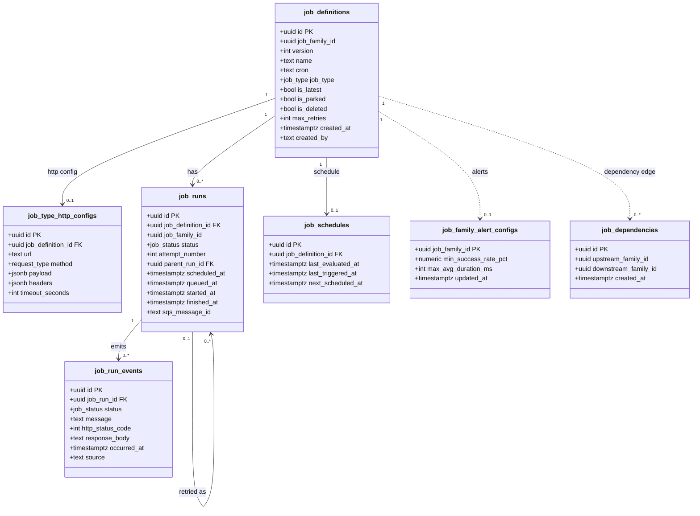

# Conductor Data Model — ER Diagram

## Enum Types

| Enum | Values |
|------|--------|
| `job_type` | `HTTP`, `SHELL`, `PYTHON` |
| `job_status` | `WAITING`, `QUEUED`, `RUNNING`, `SUCCEEDED`, `FAILED`, `RETRYING`, `CANCELLED`, `PARKED` |
| `request_type` | `GET`, `POST`, `PUT`, `DELETE`, `PATCH`, `OPTIONS`, `HEAD` |

## Implicit Relationships (no enforced FK)

| From | To | Via | Note |
|------|----|-----|------|
| `job_family_alert_configs` | `job_definitions` | `job_family_id` | No FK — orphan rows are acceptable by design |
| `job_dependencies` | `job_definitions` | `upstream_family_id` / `downstream_family_id` | References job families, not individual versions |

## Design Notes

- **Versioning** — `job_definitions` rows are immutable. Every edit creates a new row with an incremented `version`. All versions share a `job_family_id`; only one row per family has `is_latest = true`.
- **Denormalized `job_family_id` on `job_runs`** — copied from `job_definitions` at insert time to avoid joins in high-frequency analytics queries.
- **Append-only events** — `job_run_events` is never updated; every status transition appends a new row.
- **Retry chains** — `job_runs.parent_run_id` is a self-referential FK pointing to the original run, forming a chain for retry tracking.
- **Soft deletes** — `job_definitions` uses `is_deleted` and `is_parked` flags; rows are never physically removed.
- **Computed duration** — run duration is not stored; it is computed as `EXTRACT(EPOCH FROM (finished_at - started_at)) * 1000` at query time.
